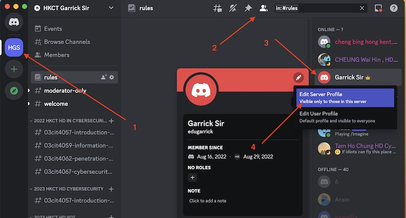
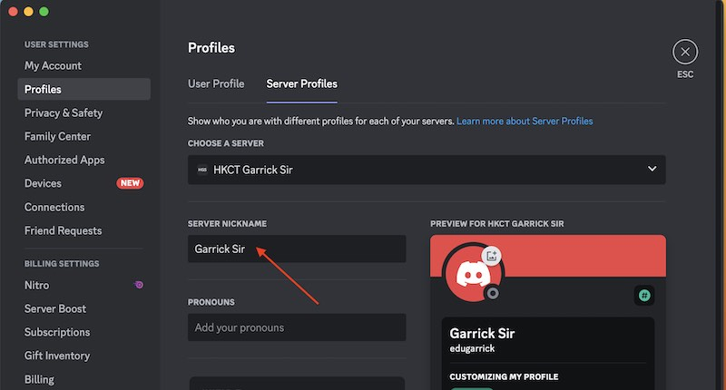

# My Server Link

# Discord setup

## Steps

### Step 1: Install Discord

1. Create an account in the Discord.com if you don't have any account.

   https://discord.com/register

2. Download the Discord app from the Discord website: 

   https://discord.com/download

3. Join "HKCT Garrick Sir" server by click the following Discord invitation URL.

   https://discord.gg/x78JHGwp6W

4. After the registration, you can use Discord by the app on PC, mac or mobile phone.
   You can also use Discord by web browser as well.

### Step 2: Update Discord Server Profile

It will be great if I can know your REAL name in my Server.
Please follow the steps belows such that I can get familiar with you.

如果我知道你的真实名字，沟通会更为方便。
请按照以下步骤操作，以便我可以更熟悉您。

1. Click the locations as follows to pop up your Server Profile  

   a.  Click "HKCT Garrick Sir" Server  
   b.  Click the "Member List" and then "Edit Server Profile"  

   

2. Your Server Profile is popped up.  

   a. Updated the name as follows such that I know who you are.

      For example:  
      例子:   

    CHAN Tai Man , HD Cybersecurity   
    陳大文 , 網絡安全高級文憑（檢測及合規）  
    陈大文, 网络安全高级文凭（检测及合规）   

    

